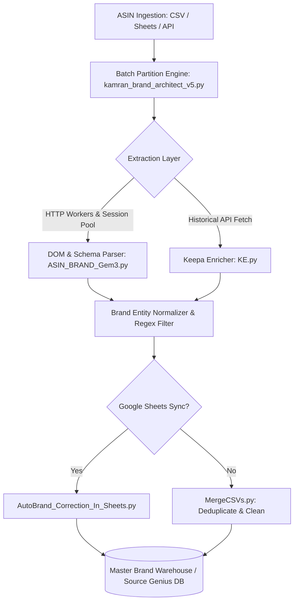

# 📊 Amazon Brand Extraction Pipeline

<div align="center">

[](LICENSE)
[](https://github.com/Kamran5H/BrandScrapers)
[](https://github.com/Kamran5H/BrandScrapers)
[](https://github.com/Kamran5H/BrandScrapers)
[](https://github.com/Kamran5H/SourceGenius)

**High-throughput Python data-pipeline suite extracting verified brand entities, manufacturer registries, and product attributes across global Amazon marketplaces.**

[Overview](#-overview) • [Pipeline Scripts](#-pipeline-scripts--architecture) • [Key Capabilities](#-key-capabilities) • [Quickstart](#-quick-start) • [License](#-license)

</div>

---

## 🌟 Overview

**BrandScrapers** is the battle-tested backend data engine powering the [Source Genius](https://github.com/Kamran5H/SourceGenius) e-commerce discovery ecosystem. Engineered to process millions of ASINs across `.com`, `.co.uk`, `.de`, `.ca`, and global Amazon regions, this suite resolves raw product identification numbers into verified corporate brand names, eliminating noisy seller storefront pseudonyms and third-party reseller artifacts.

---

## 🚀 Key Capabilities

- **⚡ Multi-Tier Brand Resolution**:
  - Direct Byline Parsing (`Visit the [Brand] Store` / `Brand: [Name]`)
  - Canonical Metadata Extraction & JSON-LD schema parsing
  - Title regex NLP extraction for unbranded or obfuscated listings
- **🛡️ High-Throughput & Rate-Limit Evasion**:
  - Dynamic user-agent rotation with realistic hardware fingerprint headers
  - Automated session recycling and exponential backoff retry algorithms
  - Anti-CAPTCHA bypass heuristics and fallback endpoints
- **🔗 Enterprise Integrations**:
  - Native **Keepa API** ingestion (`KE.py`) for historical sales rank, BSR, and category velocity
  - Automated Google Sheets bi-directional synchronization (`AutoBrand_Correction_In_Sheets.py`)
  - Mass CSV deduplication and ETL normalization (`MergeCSVs.py`)

---

## 🏗️ Pipeline Scripts & Architecture



### Module Inventory

| Script | Purpose & Description |
| :--- | :--- |
| `kamran_brand_architect_v5.py` | Flagship batched, multi-threaded Amazon brand extraction engine with proxy management. |
| `kamran_brand_architect_5_2x.py` | Optimized iteration featuring accelerated async request pipelines and refined heuristics. |
| `ASIN_BRAND_Gem3.py` | Focused micro-worker for high-precision ASIN-to-Brand resolution. |
| `AutoBrand_Correction_In_Sheets.py` | Google Sheets API automation for live spreadsheet validation and brand normalization. |
| `KE.py` | Keepa API interface for historical product velocity, sales ranks, and pricing trends. |
| `MDST.py` | Multi-domain scraping utility handling foreign Amazon regional marketplaces. |
| `MergeCSVs.py` | Post-processing ETL script for consolidating and deduplicating batch CSV outputs. |
| `Scrapper More Advanced.py` | Advanced experimental scraper testing novel DOM traversal strategies. |
| `block.py` | IP ban & CAPTCHA detection sentinel ensuring worker health. |

---

## 📁 Repository Structure

```text
BrandScrapers/
├── kamran_brand_architect_v5.py       # Core enterprise scraping pipeline
├── kamran_brand_architect_5_2x.py     # High-speed optimized scraping variant
├── ASIN_BRAND_Gem3.py                 # Precision ASIN brand parser
├── AutoBrand_Correction_In_Sheets.py  # Google Sheets sync & correction worker
├── KE.py                              # Keepa API integration client
├── MDST.py                            # Multi-domain marketplace reader
├── MergeCSVs.py                       # Batch CSV aggregator & cleaner
├── block.py                           # Anti-bot and block detection handler
├── .gitignore                         # Data file & credential exclusions
└── LICENSE                            # Open-source MIT License
```

---

## ⚡ Quick Start

### 1. Installation
```bash
git clone https://github.com/Kamran5H/BrandScrapers.git
cd BrandScrapers

# Setup virtual environment
python -m venv .venv
# On Windows:
.venv\Scripts\activate
# On Linux/macOS:
source .venv/bin/activate

# Install dependencies
pip install requests beautifulsoup4 pandas gspread oauth2client
```

### 2. Run Brand Architect Pipeline
```bash
# Execute the primary multi-threaded brand extraction engine
python kamran_brand_architect_v5.py

# Consolidate multiple output CSV files into a unified clean dataset
python MergeCSVs.py
```

---

## 📜 License

This project is open-source and released under the [MIT License](LICENSE).  
Copyright (c) 2024-2026 **Kamran Ashraf**.
